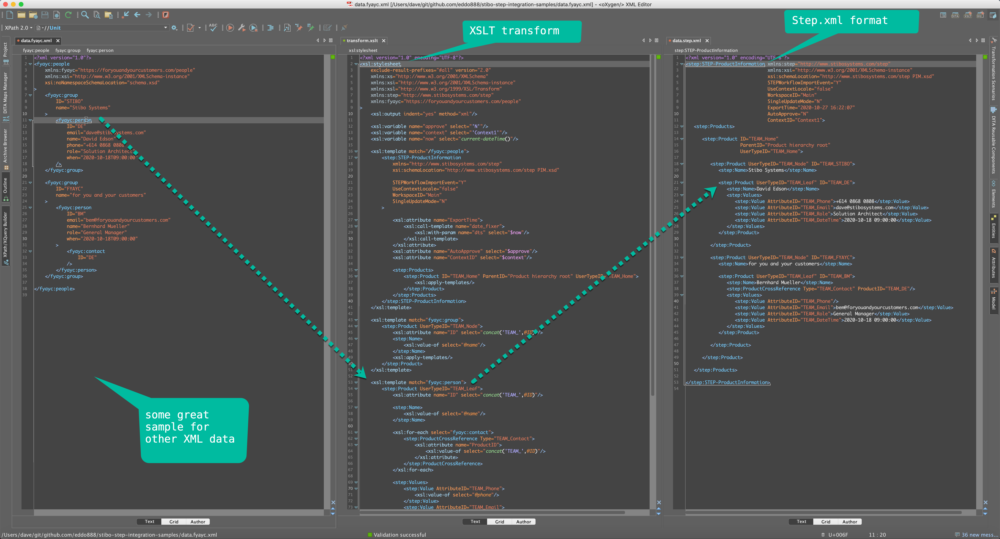
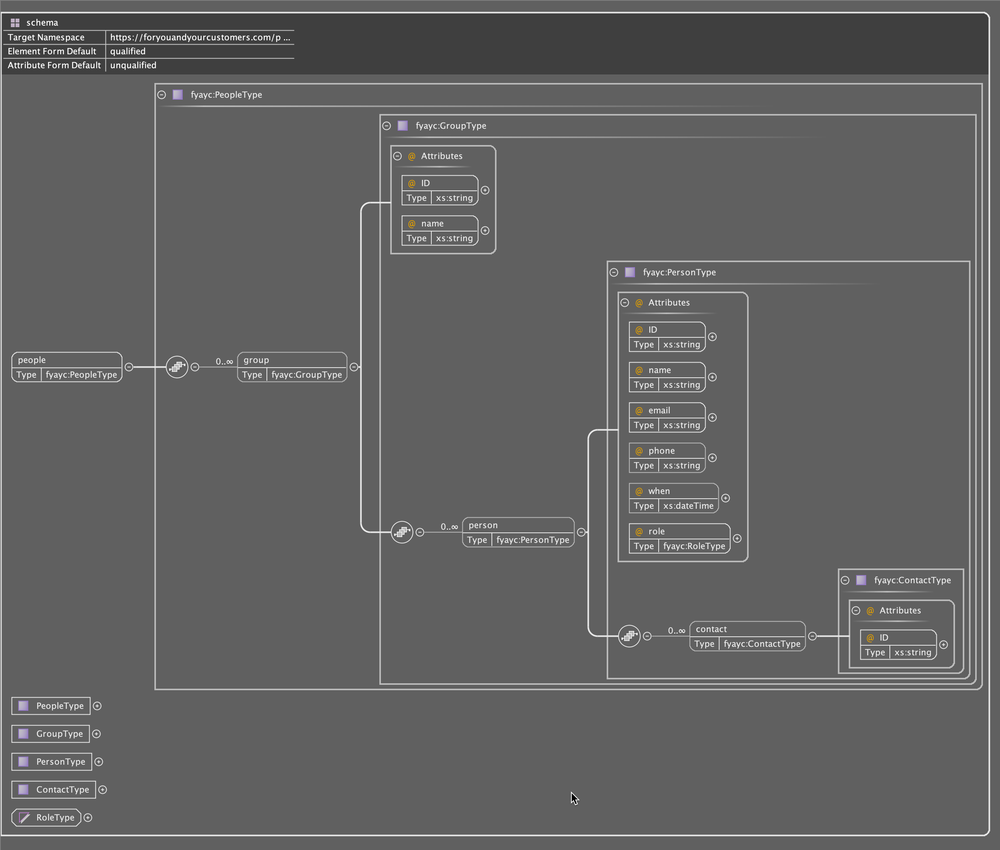
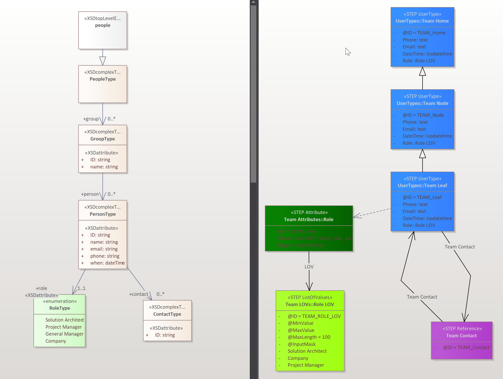

# stibo-step-integration-samples

These are the sample files from the users group session.

# data.fyayc.xml

sample xml file using schema namespaces that can be used to define and validate the xml data

# schema.png

Defines the attributes, elements and parent child relationships, as well as a List Of Values called an Enumeration.

Please see [W3C](https://www.w3.org/standards/xml/schema) for more information on xml schemas
Please see [w3schools](https://www.w3schools.com/xml/schema_intro.asp) for excellent training

# PIM.xsd

The Stibo schema for STEP.XML format data, Stibo uses this format to import and export all of our structure, data, logic and configuration, it is the primary Stibo data format for offline storage.

When systems are migrated from one system to another, we use STEP.XML formats.

[STEP.XML doco](https://service.stibosystems.com/documentation/latest/Default.html#data_exchange/data_formats/stepxml_format.html)

# exported.step.xml

The configuration used for our demonstration in STEP.XML format.

# exported.step.xml.xmi

A UML format (XMI) that can be used in tools like [Enterprise Architect by Sparx](https://sparxsystems.com)

# transform.xslt

converts FYAYC XML into STEP.XML

please see [W3C](https://www.w3.org/TR/xslt/) for more info on xslt
please see [w3schools](https://www.w3schools.com/xml/xsl_intro.asp) to get training

# data.step.xml

The output from the xslt transform that can be directly loaded into STEP as STEP.XML format.

# imported.xlsx

sample input file for Excel

# exported.xlsm

sample smart sheet export from STEP

